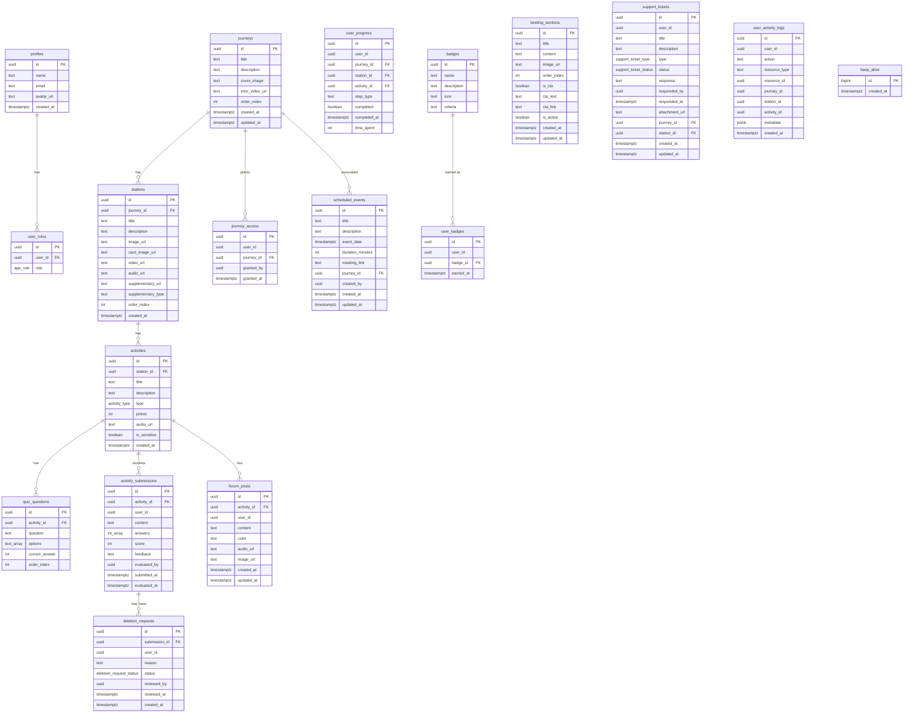
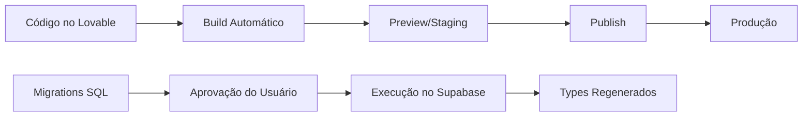

# Documentação Técnica e de Negócio — Plataforma SNI (Ser, Nutrir, Integrar)

**Versão:** 1.0  
**Data:** 20/02/2026  
**Domínio de Produção:** https://sni.plataformaativa.com.br  
**Domínio Staging:** https://journey-station-space.lovable.app

---

## Sumário

1. [Visão Geral do Produto](#1-visão-geral-do-produto)
2. [Marketing e Posicionamento](#2-marketing-e-posicionamento)
3. [Funcionalidades](#3-funcionalidades)
4. [Regras de Negócio](#4-regras-de-negócio)
5. [Requisitos](#5-requisitos)
6. [Base de Dados](#6-base-de-dados)
7. [Tecnologia Utilizada (Stack Técnico)](#7-tecnologia-utilizada-stack-técnico)
8. [Arquitetura e Estrutura do Projeto](#8-arquitetura-e-estrutura-do-projeto)
9. [Informações Complementares](#9-informações-complementares)

---

## 1. Visão Geral do Produto

### Nome da Plataforma
**SNI — Ser, Nutrir, Integrar** (anteriormente referida como "Mulher Plena")

### Propósito e Proposta de Valor
Plataforma educacional gamificada voltada ao desenvolvimento pessoal e emocional, organizada em jornadas de aprendizado compostas por estações e atividades interativas. Oferece um ambiente seguro e acolhedor para reflexão, autoconhecimento e transformação pessoal.

### Público-Alvo e Personas
| Persona | Papel no Sistema | Descrição |
|---------|------------------|-----------|
| **Participante** | `aluno` | Pessoa em busca de desenvolvimento pessoal que percorre jornadas, assiste vídeos, completa atividades reflexivas e acompanha seu progresso |
| **Tutor(a)** | `professor` | Facilitador(a) que avalia submissões, fornece feedback e acompanha o progresso das participantes |
| **Administrador(a)** | `admin` | Gestor(a) da plataforma que gerencia conteúdo, usuários, configurações e toda a operação |

### Problema que Resolve
Oferece uma estrutura organizada e guiada para processos de autoconhecimento e desenvolvimento emocional, com acompanhamento de tutores, atividades reflexivas gamificadas e rastreamento de progresso.

### Modelo de Negócio
Plataforma educacional com controle de acesso por jornada. O acesso às jornadas é liberado manualmente pelo administrador (modelo de venda/liberação individual ou em grupo). Não há sistema de pagamento integrado na plataforma — a gestão financeira ocorre externamente.

### Estágio Atual
**Produção** — A plataforma está publicada e em uso ativo no domínio customizado.

---

## 2. Marketing e Posicionamento

### Proposta Única de Valor (UVP)
Jornada estruturada de autoconhecimento com atividades reflexivas gamificadas, acompanhamento personalizado de tutoras e ambiente digital seguro e acolhedor.

### Principais Diferenciais Competitivos
- Atividades gamificadas interativas (mural de visão, árvore da gratidão, roda do amor, linha da vida, etc.)
- Sistema de "experiência sensível" que prepara o usuário para conteúdos emocionalmente intensos
- Fórum colaborativo por atividade (mural de post-its coloridos com áudio e imagem)
- Progressão configurável por estação (pesos personalizáveis para vídeo, atividade, material complementar, podcast)
- Controle de acesso granular por jornada

### Tom de Voz e Identidade de Marca
- **Tom:** Acolhedor, empático, feminino, motivacional
- **Paleta de Cores:** Burgundy (#7B2D42) como primária, Gold (#C9A84C) como accent, fundo creme
- **Tipografia:** Cinzel (títulos — serifada elegante) + Poppins (corpo — sans-serif moderna)
- **Visual:** Elegante e sofisticado, com gradientes burgundy e detalhes dourados

### Canais de Aquisição
A definir — gestão de marketing ocorre externamente à plataforma.

### Estratégia de Onboarding
1. Usuário acessa a landing page dinâmica (configurável pelo admin)
2. Realiza cadastro com email e senha
3. Confirma email (Supabase Auth)
4. Admin libera acesso às jornadas desejadas
5. Participante acessa o dashboard e inicia as jornadas

### Métricas-Chave (KPIs)
- Progresso por jornada e estação
- Submissões pendentes de avaliação
- Conquistas (badges) desbloqueadas
- Pontuação acumulada por participante
- Logs de atividade do usuário (login, views, submissões)

### Copywriting Principal
- **Landing Page:** Configurável pelo admin via CMS integrado (seções dinâmicas com imagem, título, conteúdo HTML e CTAs)
- **Login:** "Entre com suas credenciais para acessar a plataforma"
- **Registro:** "Crie sua conta para começar"
- **Dashboard Aluno:** "Continue sua jornada de aprendizado"
- **Dashboard Tutor:** "Acompanhe o progresso das participantes"
- **Dashboard Admin:** "Gerencie a plataforma de cursos"

---

## 3. Funcionalidades

### 3.1 Módulo de Autenticação

| Funcionalidade | Status | Descrição |
|----------------|--------|-----------|
| Login com email/senha | ✅ Implementada | Autenticação via Supabase Auth com toggle de visibilidade de senha |
| Cadastro de novos usuários | ✅ Implementada | Registro com nome, email e senha; confirmação por email |
| Recuperação de senha | ✅ Implementada | Envio de link por email com redirecionamento para domínio de produção |
| Redefinição de senha | ✅ Implementada | Página dedicada com validação de token recovery e toggle de visibilidade |
| Logout | ✅ Implementada | Com log de atividade |

### 3.2 Módulo de Jornadas (Participante)

| Funcionalidade | Status | Descrição |
|----------------|--------|-----------|
| Listagem de jornadas | ✅ Implementada | Grid de cards com imagem de capa, título e barra de progresso |
| Controle de acesso por jornada | ✅ Implementada | Jornadas bloqueadas mostram ícone de cadeado e mensagem explicativa |
| Pré-requisitos (jornadas 1-3) | ✅ Implementada | Jornadas 4+ requerem conclusão de 1, 2 e 3 |
| Detalhe da jornada | ✅ Implementada | Lista de estações com navegação, vídeo introdutório opcional, eventos agendados |
| Progresso da jornada | ✅ Implementada | Calculado como média do progresso das estações |

### 3.3 Módulo de Estações (Participante)

| Funcionalidade | Status | Descrição |
|----------------|--------|-----------|
| Visualização da estação | ✅ Implementada | Imagem de banner, descrição (HTML rico), vídeo, atividade, áudio, material complementar |
| Vídeo-aula (YouTube/Vimeo) | ✅ Implementada | Player embeddado com checkbox "marcar como assistido" |
| Atividade da estação | ✅ Implementada | Link para a página de atividade com status de conclusão |
| Áudio/Podcast | ✅ Implementada | Player de áudio nativo com checkbox "marcar como ouvido" |
| Material complementar | ✅ Implementada | Suporta vídeo, artigo (link externo) e podcast; com checkbox de conclusão |
| Barra de progresso | ✅ Implementada | Progresso calculado com pesos configuráveis (vídeo, atividade, suplementar, podcast) |
| Celebração ao completar | ✅ Implementada | Confetti + toast de parabéns ao atingir 100% |
| Navegação entre estações | ✅ Implementada | Botões anterior/próxima estação |
| Controle de tamanho de fonte | ✅ Implementada | Ajuste de fonte para acessibilidade na descrição |

### 3.4 Módulo de Atividades

| Tipo de Atividade | Status | Descrição |
|-------------------|--------|-----------|
| **Quiz** | ✅ Implementada | Perguntas com múltipla escolha; correção automática com score |
| **Dissertativa (Essay)** | ✅ Implementada | Campo de texto livre com suporte a atividades especiais |
| **Upload** | ✅ Implementada | Upload de arquivo com storage no Supabase |
| **Gamificada** | ✅ Implementada | Atividades interativas especiais (vide lista abaixo) |
| **Fórum** | ✅ Implementada | Mural colaborativo com post-its coloridos, áudio e imagem |

#### Atividades Gamificadas Especiais

| Atividade | Tipo Detectado por | Descrição |
|-----------|-------------------|-----------|
| Mural de Visão (VisionBoard) | `gamified` | Canvas interativo com fabric.js para criação de mural visual |
| Lista de Gratidão | `essay` (título) | 5 campos estruturados de aspecto + significado |
| Árvore da Gratidão (FamilyTree) | Título contém "árvore da gratidão" | Árvore visual interativa |
| Linha da Vida (Timeline) | Título contém "linha da vida" | Timeline interativa com marcos |
| Farol das Emoções (TrafficLight) | Título contém "farol" | Semáforo emocional com categorização |
| Farol da Minha Vida | Título contém "farol da minha vida" | Variação do farol com foco na vida pessoal |
| Diário de Papéis (RoleDiary) | Título contém "diário de papéis" | Registro estruturado de papéis sociais |
| Mapa de Vida Equilibrada | Título contém "mapa de vida equilibrada" | Mapa visual de equilíbrio de vida |
| Carta Não Enviada | Título contém "carta n...enviada" | Escrita terapêutica de carta |
| Ação de Amor | Título contém "ação de amor" | Registro de ações de amor |
| Relato de Reconciliação | Título contém "relato" + "reconcilia" | Narrativa de reconciliação |
| Carta de Compromisso | Título contém "carta de compromisso" | Compromisso pessoal |
| Registro de Situação Real | Título contém "registro de situa" | Registro situacional |
| Roda de Amor | Título contém "roda de amor" | Roda visual de amor |
| Diário do Bem-Estar | Título contém "diário do bem-estar" | Registro de bem-estar |
| Inventário Emocional | Título contém "inventário emocional" | Levantamento emocional |
| Roleta de Palavras (WordRoulette) | Gamificada genérica | Jogo de palavras interativo |
| Afirmação de Potencial | Título = "Afirmação de Potencial" | Escrita de afirmações |
| Manifesto / Ensaio Reflexivo | Título contém "manifesto" ou "ensaio reflexivo" | Com opção de compartilhar no fórum |
| Caixa da Alegria | Título contém "caixa da alegria" | Atividade de alegria |

#### Funcionalidades Transversais de Atividades

| Funcionalidade | Status | Descrição |
|----------------|--------|-----------|
| Experiência Sensível | ✅ Implementada | Banner de aviso + dialog com mensagem configurável para atividades sensíveis |
| Edição de submissão | ✅ Implementada | Participantes podem editar texto antes da avaliação |
| Solicitação de refazer | ✅ Implementada | Participante pode solicitar exclusão da submissão para reenvio, com aprovação do tutor/admin |
| Compartilhar no fórum | ✅ Implementada | Opção de publicar manifesto/ensaio no mural coletivo |
| Áudio da atividade | ✅ Implementada | Player de áudio opcional por atividade |
| Edição inline (admin) | ✅ Implementada | Admin pode editar título e descrição da atividade diretamente na página |

### 3.5 Módulo de Avaliações (Tutor/Admin)

| Funcionalidade | Status | Descrição |
|----------------|--------|-----------|
| Listagem de submissões | ✅ Implementada | Tabs de pendentes e avaliadas |
| Filtros avançados | ✅ Implementada | Por participante, jornada, estação e período |
| Avaliação com nota e feedback | ✅ Implementada | Score numérico + texto de feedback |
| Visualização de submissões especiais | ✅ Implementada | Renderização específica para cada tipo de atividade gamificada |
| Exclusão de submissão | ✅ Implementada | Permite reenvio pelo participante |
| Gestão de solicitações de refazer | ✅ Implementada | Aprovar/recusar solicitações de exclusão |

### 3.6 Módulo de Conquistas (Participante)

| Funcionalidade | Status | Descrição |
|----------------|--------|-----------|
| Listagem de badges | ✅ Implementada | Grid com badges conquistados e bloqueados |
| Resumo de progresso | ✅ Implementada | Contagem e percentual de conquistas |

### 3.7 Módulo de Administração

#### Gerenciamento de Conteúdo (Admin)

| Funcionalidade | Status | Descrição |
|----------------|--------|-----------|
| CRUD de Jornadas | ✅ Implementada | Criar, editar, excluir jornadas com título, descrição, imagem de capa e ordem |
| CRUD de Estações | ✅ Implementada | Dentro de cada jornada; com vídeo, descrição HTML, imagem, áudio, material complementar |
| CRUD de Atividades | ✅ Implementada | Dentro de cada estação; com tipo, pontos, áudio, flag de sensível |
| CRUD de Perguntas de Quiz | ✅ Implementada | Perguntas com opções e resposta correta |
| Importação CSV de Jornadas | ✅ Implementada | Upload de CSV para importação em lote |
| Vídeo introdutório por jornada | ✅ Implementada | URL de vídeo de introdução opcional |

#### Gerenciamento de Landing Page (Admin)

| Funcionalidade | Status | Descrição |
|----------------|--------|-----------|
| CRUD de seções da landing | ✅ Implementada | Seções com título, conteúdo HTML, imagem, CTA, ordem e flag ativo |
| Preview da landing | ✅ Implementada | Visualização ao vivo na rota `/` |

#### Gerenciamento de Usuários (Admin)

| Funcionalidade | Status | Descrição |
|----------------|--------|-----------|
| Listagem de usuários | ✅ Implementada | Com nome, email, data de cadastro e papel |
| Filtro por nome e papel | ✅ Implementada | Busca textual e filtro por role |
| Alteração de papel | ✅ Implementada | Admin pode mudar role entre admin, professor e aluno |
| Edição de nome | ✅ Implementada | Admin pode alterar o nome do usuário |
| Contagem por papel | ✅ Implementada | Cards com totais de admins, tutores e participantes |
| Controle de acesso a jornadas | ✅ Implementada | Liberar/revogar acesso individual por jornada por usuário |

#### Calendário de Eventos (Admin)

| Funcionalidade | Status | Descrição |
|----------------|--------|-----------|
| CRUD de eventos agendados | ✅ Implementada | Título, data, duração, link de reunião, jornada associada |
| Visualização de calendário | ✅ Implementada | Calendário visual com eventos |
| Próximos eventos | ✅ Implementada | Widget no dashboard e na página de jornada |

#### Repositório de Imagens (Admin)

| Funcionalidade | Status | Descrição |
|----------------|--------|-----------|
| Biblioteca de imagens | ✅ Implementada | Upload e gestão de imagens no Supabase Storage |

#### Logs de Atividade (Admin)

| Funcionalidade | Status | Descrição |
|----------------|--------|-----------|
| Registro de ações | ✅ Implementada | Login, logout, visualizações, submissões, etc. |
| Visualização de logs | ✅ Implementada | Página dedicada com listagem |

#### Suporte (Todos os papéis)

| Funcionalidade | Status | Descrição |
|----------------|--------|-----------|
| Criação de tickets | ✅ Implementada | Tipo (bug/melhoria), título, descrição, anexo, jornada e estação opcionais |
| Upload de anexos | ✅ Implementada | Imagens e documentos até 10MB |
| Resposta a tickets (Admin) | ✅ Implementada | Texto de resposta + alteração de status |
| Filtros de tickets (Admin) | ✅ Implementada | Por tipo e status |
| Exclusão de tickets | ✅ Implementada | Participante pode excluir tickets sem resposta |

### 3.8 Configurações do Sistema (Admin)

| Funcionalidade | Status | Descrição |
|----------------|--------|-----------|
| Exibir nota para participantes | ✅ Implementada | Toggle on/off |
| Exibir feedback para participantes | ✅ Implementada | Toggle on/off |
| Percentuais de conclusão de estação | ✅ Implementada | Pesos configuráveis para vídeo, atividade, suplementar, podcast (soma = 100%) |
| Mensagem de experiência sensível | ✅ Implementada | Texto personalizável |
| Imagem de fundo do login | ✅ Implementada | Upload de imagem customizada |
| Cor da linha do menu | ✅ Implementada | Color picker para borda do header |
| Cor da barra de progresso | ✅ Implementada | Color picker para barras de progresso |

> **Nota:** Configurações são armazenadas em `localStorage`, ou seja, são por navegador/dispositivo.

### 3.9 Integrações com Serviços Externos

| Serviço | Status | Uso |
|---------|--------|-----|
| Supabase Auth | ✅ Ativa | Autenticação de usuários |
| Supabase Database (PostgreSQL) | ✅ Ativa | Persistência de todos os dados |
| Supabase Storage | ✅ Ativa | Armazenamento de imagens, áudios, vídeos e anexos |
| YouTube/Vimeo (embed) | ✅ Ativa | Reprodução de vídeos nas estações |

### 3.10 Funcionalidades de Notificação

| Tipo | Status | Descrição |
|------|--------|-----------|
| Email de confirmação de conta | ✅ Implementada (Supabase) | Template padrão do Supabase |
| Email de recuperação de senha | ✅ Implementada (Supabase) | Template padrão do Supabase |
| Notificações in-app (Toast) | ✅ Implementada | Toasts de sucesso/erro para todas as ações |
| Push notifications | ❌ Não implementada | A definir |
| SMS | ❌ Não implementada | Não aplicável |

---

## 4. Regras de Negócio

### 4.1 Acesso a Jornadas

| Regra | Descrição |
|-------|-----------|
| RN-01 | Toda jornada requer liberação explícita do administrador via `journey_access` |
| RN-02 | Jornadas com `order_index > 3` requerem adicionalmente que as jornadas 1, 2 e 3 estejam 100% completas (pré-requisito) |
| RN-03 | Jornadas bloqueadas exibem ícone de cadeado e mensagem explicativa (diferenciando entre "pré-requisitos" e "não liberada") |
| RN-04 | Admins e tutores podem visualizar todas as jornadas sem restrição de acesso |

### 4.2 Progresso de Estação

| Regra | Descrição |
|-------|-----------|
| RN-05 | O progresso de cada estação é calculado com base em pesos configuráveis: Vídeo (padrão 35%), Atividade (35%), Material Complementar (20%), Podcast (10%) |
| RN-06 | A soma dos pesos deve ser exatamente 100% |
| RN-07 | Apenas etapas presentes na estação são consideradas no cálculo (normalização proporcional) |
| RN-08 | Vídeo e Podcast: marcação manual pelo participante |
| RN-09 | Material complementar: marcação manual pelo participante |
| RN-10 | Atividade: marcação automática ao enviar submissão |
| RN-11 | Ao atingir 100%, é exibida celebração com confetti e toast |

### 4.3 Progresso de Jornada

| Regra | Descrição |
|-------|-----------|
| RN-12 | Progresso da jornada = média aritmética do progresso de todas as estações da jornada |

### 4.4 Submissões e Avaliações

| Regra | Descrição |
|-------|-----------|
| RN-13 | Cada participante pode enviar apenas uma submissão por atividade |
| RN-14 | Quiz: correção automática com cálculo de score percentual |
| RN-15 | Essay/Upload/Gamificada: avaliação manual por tutor ou admin |
| RN-16 | Avaliação inclui score numérico e feedback textual opcional |
| RN-17 | A visibilidade de nota e feedback para participantes é configurável globalmente |
| RN-18 | Participante pode solicitar "refazer" atividade (cria deletion_request) |
| RN-19 | Tutor/Admin pode aprovar ou rejeitar solicitação de refazer |
| RN-20 | Ao aprovar, a submissão é excluída e o participante pode reenviar |
| RN-21 | Tutor/Admin pode excluir submissão diretamente (sem solicitação) |

### 4.5 Fórum

| Regra | Descrição |
|-------|-----------|
| RN-22 | Cada atividade do tipo `forum` tem seu próprio mural |
| RN-23 | Posts podem incluir texto, cor de fundo, áudio e imagem |
| RN-24 | Participantes podem editar e excluir seus próprios posts |
| RN-25 | Admins e tutores podem excluir qualquer post |

### 4.6 Papéis e Permissões

| Papel | Permissões |
|-------|------------|
| **Participante (aluno)** | Visualizar jornadas liberadas, acessar estações, enviar submissões, ver conquistas, criar tickets de suporte, solicitar refazer atividade |
| **Tutor(a) (professor)** | Tudo do participante + avaliar submissões, fornecer feedback, gerenciar solicitações de exclusão, ver todas as submissões |
| **Administrador(a) (admin)** | Tudo do tutor + gerenciar conteúdo (CRUD jornadas/estações/atividades), gerenciar usuários e roles, controlar acesso a jornadas, gerenciar landing page, configurações do sistema, calendário, repositório de imagens, logs de atividade, responder tickets de suporte |

### 4.7 Experiência Sensível

| Regra | Descrição |
|-------|-----------|
| RN-26 | Atividades podem ser marcadas como "experiência sensível" pelo admin |
| RN-27 | Quando marcada, exibe banner clicável na página da atividade |
| RN-28 | Ao clicar, abre dialog com mensagem de acolhimento configurável nas Configurações |

### 4.8 Tickets de Suporte

| Regra | Descrição |
|-------|-----------|
| RN-29 | Tipos: Bug ou Melhoria |
| RN-30 | Status: Aberto → Em Andamento → Resolvido → Fechado |
| RN-31 | Participante pode excluir ticket somente se não houver resposta |
| RN-32 | Apenas admin pode responder e alterar status |
| RN-33 | Anexos: imagens e documentos até 10MB |

---

## 5. Requisitos

### 5.1 Requisitos Funcionais

| ID | Requisito |
|----|-----------|
| RF-01 | O sistema deve permitir autenticação com email e senha |
| RF-02 | O sistema deve suportar recuperação de senha por email |
| RF-03 | O sistema deve implementar três papéis: admin, professor e aluno |
| RF-04 | O sistema deve permitir CRUD completo de jornadas, estações e atividades |
| RF-05 | O sistema deve calcular progresso de estação com pesos configuráveis |
| RF-06 | O sistema deve calcular progresso de jornada como média das estações |
| RF-07 | O sistema deve suportar 5 tipos de atividade: quiz, essay, upload, gamified, forum |
| RF-08 | O sistema deve permitir avaliação de submissões com nota e feedback |
| RF-09 | O sistema deve implementar sistema de badges/conquistas |
| RF-10 | O sistema deve controlar acesso a jornadas por liberação do admin |
| RF-11 | O sistema deve implementar pré-requisitos para jornadas 4+ |
| RF-12 | O sistema deve permitir gerenciamento da landing page |
| RF-13 | O sistema deve registrar logs de atividade do usuário |
| RF-14 | O sistema deve implementar sistema de tickets de suporte |
| RF-15 | O sistema deve permitir agendamento de eventos com link de reunião |
| RF-16 | O sistema deve implementar solicitação de refazer atividade |
| RF-17 | O sistema deve suportar upload de arquivos (imagens, áudios, documentos) |
| RF-18 | O sistema deve permitir personalização visual (cores, imagem de fundo) |

### 5.2 Requisitos Não-Funcionais

| ID | Categoria | Requisito |
|----|-----------|-----------|
| RNF-01 | Performance | Carregamento inicial da dashboard em menos de 3 segundos |
| RNF-02 | Responsividade | Interface adaptável a desktop, tablet e mobile |
| RNF-03 | Segurança | Row Level Security (RLS) em todas as tabelas do banco |
| RNF-04 | Segurança | Autenticação via JWT (Supabase Auth) |
| RNF-05 | Disponibilidade | Keep-alive table para manter instância Supabase ativa |
| RNF-06 | Acessibilidade | Controle de tamanho de fonte para leitura |
| RNF-07 | UX | Feedback visual imediato via toasts para todas as ações |
| RNF-08 | UX | Animações de transição (fade-in, slide-in) |
| RNF-09 | Escalabilidade | Limite padrão de 1000 registros por query Supabase |

### 5.3 Requisitos de Integração

| API/Serviço | Direção | Formato | Descrição |
|-------------|---------|---------|-----------|
| Supabase Auth API | Consumida | REST/JWT | Autenticação e gerenciamento de sessão |
| Supabase Database API | Consumida | REST (PostgREST) | CRUD de todos os dados |
| Supabase Storage API | Consumida | REST | Upload/download de arquivos |
| YouTube oEmbed | Consumida | URL embed | Embedding de vídeos |
| Vimeo oEmbed | Consumida | URL embed | Embedding de vídeos |

### 5.4 Requisitos de UX/UI

- Design system baseado em tokens CSS semânticos (HSL)
- Componentes shadcn/ui customizados
- Tipografia: Cinzel para títulos, Poppins para corpo
- Paleta: Burgundy + Gold + Cream
- Suporte a dark mode (tokens definidos)
- Menu responsivo com drawer mobile
- Navegação por dropdown agrupado (admin)

---

## 6. Base de Dados

### 6.1 Diagrama ER



### 6.2 Enumerações do Banco

| Enum | Valores |
|------|---------|
| `activity_type` | quiz, upload, essay, gamified, forum |
| `app_role` | admin, professor, aluno |
| `deletion_request_status` | pending, approved, rejected |
| `support_ticket_status` | open, in_progress, resolved, closed |
| `support_ticket_type` | bug, improvement |

### 6.3 Funções do Banco

| Função | Descrição |
|--------|-----------|
| `has_role(_user_id, _role)` | Verifica se usuário possui determinado papel (SECURITY DEFINER) |
| `handle_new_user()` | Trigger que cria perfil e atribui role `aluno` ao cadastrar novo usuário |
| `update_updated_at_column()` | Trigger genérico para atualizar `updated_at` |

### 6.4 Políticas RLS (Resumo)

| Tabela | Leitura | Escrita | Observações |
|--------|---------|---------|-------------|
| profiles | Autenticados leem todos | Próprio usuário atualiza | INSERT via trigger |
| user_roles | Próprio + Admin | Admin gerencia | — |
| journeys | Autenticados | Admin CRUD | — |
| stations | Autenticados | Admin CRUD | — |
| activities | Autenticados | Admin CRUD | — |
| quiz_questions | Autenticados | Admin CRUD | — |
| activity_submissions | Próprio + Professor/Admin | Próprio insere; Prof/Admin atualizam/excluem | — |
| user_progress | Próprio + Professor/Admin | Próprio gerencia | — |
| badges | Autenticados | Admin CRUD | — |
| user_badges | Próprio + Professor/Admin | Próprio insere | — |
| forum_posts | Todos autenticados | Próprio CRUD; Prof/Admin excluem | — |
| landing_sections | Ativos para todos | Admin CRUD | Anônimos veem seções ativas |
| scheduled_events | Autenticados | Admin CRUD | — |
| support_tickets | Próprio + Admin | Próprio cria; Admin atualiza | Exclusão: próprio sem resposta |
| deletion_requests | Próprio + Prof/Admin | Próprio cria; Prof/Admin atualizam | Sem DELETE |
| user_activity_logs | Próprio + Admin | Próprio insere | Sem UPDATE/DELETE |
| journey_access | Próprio + Prof/Admin leem | Admin insere/exclui | Sem UPDATE |
| keep_alive | Anônimos leem | Sem escrita | Manter instância ativa |

### 6.5 Storage Buckets

| Bucket | Público | Uso |
|--------|---------|-----|
| journey-covers | ✅ | Imagens de capa das jornadas |
| station-images | ✅ | Imagens das estações |
| station-audios | ✅ | Áudios das estações |
| activity-audios | ✅ | Áudios das atividades |
| activity-videos | ✅ | Vídeos das atividades |
| forum-audios | ✅ | Áudios dos posts do fórum |
| forum-images | ✅ | Imagens dos posts do fórum |
| landing-images | ✅ | Imagens da landing page |
| support-attachments | ✅ | Anexos dos tickets de suporte |

### 6.6 Dados Sensíveis e LGPD

| Dado | Tabela | Tratamento |
|------|--------|------------|
| Email do usuário | profiles, auth.users | Visível apenas para admins na gestão de usuários |
| Nome do usuário | profiles | Visível para admins e tutores |
| Conteúdo de submissões | activity_submissions | Protegido por RLS; visível para o autor + tutores/admins |
| Posts de fórum | forum_posts | Visíveis para todos os autenticados (por design do fórum) |

> **Nota:** Não há implementação explícita de mecanismos de consentimento LGPD/GDPR, exportação de dados pessoais ou exclusão automática de conta. A definir.

---

## 7. Tecnologia Utilizada (Stack Técnico)

### Frontend

| Componente | Tecnologia |
|------------|------------|
| Framework | React 18.3.1 |
| Linguagem | TypeScript |
| Bundler | Vite |
| Estilização | Tailwind CSS + tailwindcss-animate |
| Componentes UI | shadcn/ui (Radix UI primitives) |
| Roteamento | React Router DOM 6.30 |
| Estado do Servidor | TanStack React Query 5.83 |
| Formulários | React Hook Form 7.61 + Zod 3.25 |
| Canvas | Fabric.js 6.9 (mural de visão) |
| Gráficos | Recharts 2.15 |
| Editor WYSIWYG | react-simple-wysiwyg 3.4 |
| Confetti | canvas-confetti 1.9 |
| Datas | date-fns 3.6 |
| Ícones | Lucide React 0.462 |
| Toasts | Sonner 1.7 + Radix Toast |
| Carousel | Embla Carousel React 8.6 |

### Backend

| Componente | Tecnologia |
|------------|------------|
| BaaS | Supabase (projeto externo) |
| Banco de Dados | PostgreSQL (via Supabase) |
| Autenticação | Supabase Auth (JWT) |
| Storage | Supabase Storage |
| API | PostgREST (auto-gerada pelo Supabase) |
| Edge Functions | Supabase Edge Functions (Deno) — nenhuma implementada atualmente |
| Arquitetura | Serverless / BaaS |

### Infraestrutura

| Componente | Tecnologia |
|------------|------------|
| Hosting Frontend | Lovable Cloud (Staging) / Domínio customizado (Produção) |
| Hosting Backend | Supabase Cloud |
| CDN | Incluído no Lovable/Supabase |
| CI/CD | Deploy automático via Lovable |
| Monitoramento | Logs do Supabase Dashboard |

### Ferramenta de Vibecoding
**Lovable** — Plataforma de desenvolvimento AI-first

### Versionamento
- **Git** via integração Lovable
- **Plataforma:** GitHub (implícito via Lovable)

---

## 8. Arquitetura e Estrutura do Projeto

### 8.1 Estrutura de Pastas

```
├── public/
│   ├── fonts/              # Fontes Cinzel e Poppins
│   ├── favicon.ico
│   ├── placeholder.svg
│   └── robots.txt
├── src/
│   ├── assets/             # Imagens estáticas (logos, backgrounds, botões)
│   ├── components/
│   │   ├── activities/     # Componentes de atividades gamificadas (18+ componentes)
│   │   ├── admin/          # Componentes de administração (forms, cards, managers)
│   │   ├── calendar/       # Componentes de calendário e eventos
│   │   ├── layout/         # AppLayout (header, nav, menu mobile)
│   │   └── ui/             # shadcn/ui components (40+ componentes)
│   ├── contexts/
│   │   ├── AuthContext.tsx      # Autenticação e sessão
│   │   ├── DataContext.tsx      # Estado global dos dados (717 linhas)
│   │   ├── FontSizeContext.tsx  # Acessibilidade de fonte
│   │   └── SettingsContext.tsx  # Configurações do sistema
│   ├── hooks/
│   │   ├── use-mobile.tsx       # Detecção de mobile
│   │   ├── use-toast.ts         # Hook de toast
│   │   ├── useActivityLogger.ts # Logger de atividades
│   │   └── useStorageImages.ts  # Hook para imagens do storage
│   ├── integrations/
│   │   └── supabase/
│   │       ├── client.ts        # Cliente Supabase configurado
│   │       └── types.ts         # Tipos auto-gerados (read-only)
│   ├── lib/
│   │   └── utils.ts             # Utilitários (cn, etc.)
│   ├── pages/               # 20 páginas da aplicação
│   ├── types/
│   │   └── index.ts         # Tipos TypeScript (208 linhas)
│   ├── App.tsx              # Rotas e providers
│   ├── App.css
│   ├── index.css            # Design tokens e estilos globais
│   ├── main.tsx             # Entry point
│   └── vite-env.d.ts
├── supabase/
│   ├── config.toml          # Configuração do Supabase
│   └── migrations/          # Migrações SQL (read-only)
├── .env                     # Variáveis de ambiente (Supabase)
├── tailwind.config.ts
├── vite.config.ts
├── tsconfig.json
└── package.json
```

### 8.2 Padrões Arquiteturais

| Padrão | Implementação |
|--------|--------------|
| **Context API** | Estado global via React Context (Auth, Data, Settings, FontSize) |
| **Provider Pattern** | Hierarquia: QueryClient → Auth → Settings → Data → FontSize → Tooltip |
| **Custom Hooks** | Abstração de lógica reutilizável (useActivityLogger, useStorageImages, useMobile) |
| **Component Composition** | shadcn/ui com composição de primitivos Radix UI |
| **Feature-based Organization** | Componentes agrupados por domínio (activities/, admin/, calendar/) |
| **Protected Routes** | HOC `ProtectedRoute` que verifica autenticação |
| **Optimistic UI** | Updates locais do estado antes da confirmação do servidor |

### 8.3 Fluxo de Deploy



- **Frontend:** Deploy via botão "Publish" no Lovable → CDN
- **Backend (DB):** Migrations aplicadas imediatamente após aprovação
- **Edge Functions:** Deploy automático (nenhuma implementada)
- **Ambientes:** Test (preview) e Live (produção) com dados isolados

### 8.4 Estratégia de Testes

| Tipo | Status |
|------|--------|
| Testes unitários | ❌ Não implementados |
| Testes de integração | ❌ Não implementados |
| Testes E2E | ❌ Não implementados |
| Testes manuais | ✅ Via preview do Lovable |

---

## 9. Informações Complementares

### 9.1 Limitações Conhecidas e Débitos Técnicos

| Item | Descrição | Severidade |
|------|-----------|------------|
| Configurações em localStorage | Settings não sincronizam entre dispositivos/navegadores | Média |
| DataContext monolítico | 717 linhas; deveria ser dividido em contextos menores | Média |
| ActivityPage monolítico | ~2000 linhas; detecção de tipo por título é frágil | Alta |
| Total de usuários mock | Dashboard admin mostra `totalUsers = 3` (hardcoded) | Baixa |
| Sem testes automatizados | Nenhum teste unitário, integração ou E2E | Alta |
| Tipos duplicados | `src/types/index.ts` replica parcialmente `supabase/types.ts` | Baixa |
| Detecção de atividade por título | Atividades gamificadas são detectadas por substring do título, não por campo dedicado | Alta |
| Sem internacionalização (i18n) | Interface fixa em português | Baixa |
| Buckets todos públicos | Todos os 9 storage buckets são públicos | Média |
| Sem LGPD compliance | Falta consentimento, exportação e exclusão de dados | Alta |
| Sem rate limiting | Sem proteção contra abuso de API no frontend | Média |

### 9.2 Roadmap de Próximas Funcionalidades

A definir pelo stakeholder. Sugestões com base na análise:

1. Migrar configurações de `localStorage` para tabela no Supabase
2. Adicionar campo `subtype` na tabela `activities` para eliminar detecção por título
3. Implementar LGPD (consentimento, exportação de dados, exclusão de conta)
4. Adicionar notificações por email para novas avaliações e respostas de suporte
5. Dashboard admin: contagem real de usuários (substituir mock)
6. Testes automatizados (Vitest + Testing Library)
7. Refatorar DataContext em contextos menores
8. Implementar sistema de pagamento para liberação de jornadas

### 9.3 Dependências Críticas

| Dependência | Risco |
|-------------|-------|
| Supabase | Toda a infraestrutura de backend depende do Supabase. Downtime = plataforma offline |
| Lovable | Hosting e deploy dependem do Lovable Cloud |
| YouTube/Vimeo | Vídeos dependem de disponibilidade dos serviços de embedding |
| Fabric.js | Mural de visão depende desta biblioteca para canvas interativo |

### 9.4 Estrutura de Rotas

| Rota | Página | Acesso | Descrição |
|------|--------|--------|-----------|
| `/` | LandingPage | Público | Página inicial dinâmica |
| `/login` | Login | Público | Tela de login |
| `/registro` | Register | Público | Tela de cadastro |
| `/recuperar-senha` | ForgotPassword | Público | Solicitar redefinição de senha |
| `/redefinir-senha` | ResetPassword | Público | Redefinir senha (via token) |
| `/dashboard` | Dashboard | Autenticado | Painel principal (varia por papel) |
| `/jornadas` | Journeys | Autenticado | Listagem de jornadas |
| `/jornadas/:id` | JourneyDetail | Autenticado | Detalhe da jornada |
| `/estacao/:id` | StationDetail | Autenticado | Detalhe da estação |
| `/atividade/:id` | ActivityPage | Autenticado | Página da atividade |
| `/conquistas` | Achievements | Autenticado | Badges do participante |
| `/avaliacoes` | Evaluations | Autenticado | Avaliações (tutor/admin) |
| `/submissao/:id` | SubmissionView | Autenticado | Visualizar submissão |
| `/gerenciar` | ManageContent | Admin | CRUD de jornadas/estações |
| `/gerenciar-landing` | ManageLandingPage | Admin | CRUD da landing page |
| `/usuarios` | UsersPage | Admin | Gestão de usuários |
| `/imagens` | ImageLibraryPage | Admin | Repositório de imagens |
| `/logs` | ActivityLogsPage | Admin | Logs de atividade |
| `/configuracoes` | Settings | Autenticado | Configurações do sistema |
| `/calendario` | CalendarPage | Admin | Calendário de eventos |
| `/suporte` | SupportPage | Autenticado | Tickets de suporte |
| `*` | NotFound | Público | Página 404 |

### 9.5 Glossário de Termos do Domínio

| Termo | Definição |
|-------|-----------|
| **Jornada** | Unidade macro de conteúdo educacional, equivalente a um módulo ou curso |
| **Estação** | Subdivisão de uma jornada; contém vídeo, descrição, atividade, áudio e material complementar |
| **Atividade** | Tarefa a ser realizada pelo participante dentro de uma estação |
| **Submissão** | Resposta/envio do participante para uma atividade |
| **Badge** | Conquista/emblema desbloqueado por completar critérios específicos |
| **Experiência Sensível** | Flag que indica conteúdo emocionalmente intenso, com aviso prévio |
| **Mural / Fórum** | Espaço colaborativo de post-its visuais dentro de uma atividade |
| **Material Complementar** | Conteúdo adicional (vídeo, artigo, podcast) vinculado a uma estação |
| **Solicitação de Refazer** | Pedido do participante para excluir sua submissão e poder reenviar |
| **Ticket** | Solicitação de suporte (bug ou melhoria) |
| **Progresso** | Percentual de conclusão de uma estação ou jornada |
| **Pré-requisito** | Condição de conclusão das jornadas 1-3 para acessar jornadas 4+ |
| **Liberação** | Ação do admin de conceder acesso a uma jornada para um participante |

---

*Documento gerado automaticamente com base na análise completa do código-fonte, banco de dados e configurações da plataforma SNI.*
